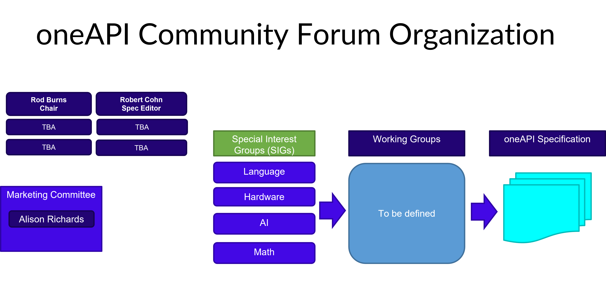

==================================
 oneAPI Community Forum Governance
==================================

The oneAPI Community Forum aims to bring individuals and
organizations together to:

* Define a standards-based, cross-architecture open specification for
  accelerated computing
* Foster open-source implementations of the specification

The oneAPI Community Forum intends to use a light weight model
of governance to facilitate straightforward collaboration for
the oneAPI specification and the open source implementations.

oneAPI Community Forum Policies
-------------------------------

The current policies are documented `on this page. <oneAPI-Policies.rst>`__

oneAPI Community Forum Structure
--------------------------------

oneAPI Community Forum Steering Committee
-----------------------------------------

The Steering Committee is led by Rod Burns from Codeplay
Software and meets quarterly.

The Steering Committee is responsible for leadership of the
forum, including these activities:

* Agreeing and tracking annual goals for the oneAPI Community Forum
* Agreeing on the formation of new Working Groups and SIGs
* Reviewing votes from the Working Groups
* Owning and defining the intellectual property framework for contributions
* Ratifying new versions of the specification
* Approving the plans from the Marketing Committee

oneAPI Community Forum Special Interest Groups (SIGs)
-----------------------------------------------------

The SIGs exist to faciliate technical discussions that are
highly relevant to bring positive change to the oneAPI
specification and the implementations of its elements.

SIG activities include the following:

* Open technical discussions relevant to specific technologies and the
  oneAPI specification
* Facilitating discussion and presentation of proposals

New SIGs can be proposed by members of the community.

oneAPI Community Forum Working Groups
-------------------------------------

The oneAPI Community Forum Working Groups (WGs) exist to
facilitate modifications to the oneAPI specification.

Working Groups will be formed in early 2023. These can be
proposed by members of the oneAPI Community Forum SIGs.

oneAPI Community Forum Marketing Committee
------------------------------------------

The Marketing Committee meetings are open to anyone. The
committee owns the definition and execution of the
marketing strategy, steers the content on the website,
coordinates event activities and coordinates marketing
activities between the community.

The Marketing Committee is led by Alison Richards.
